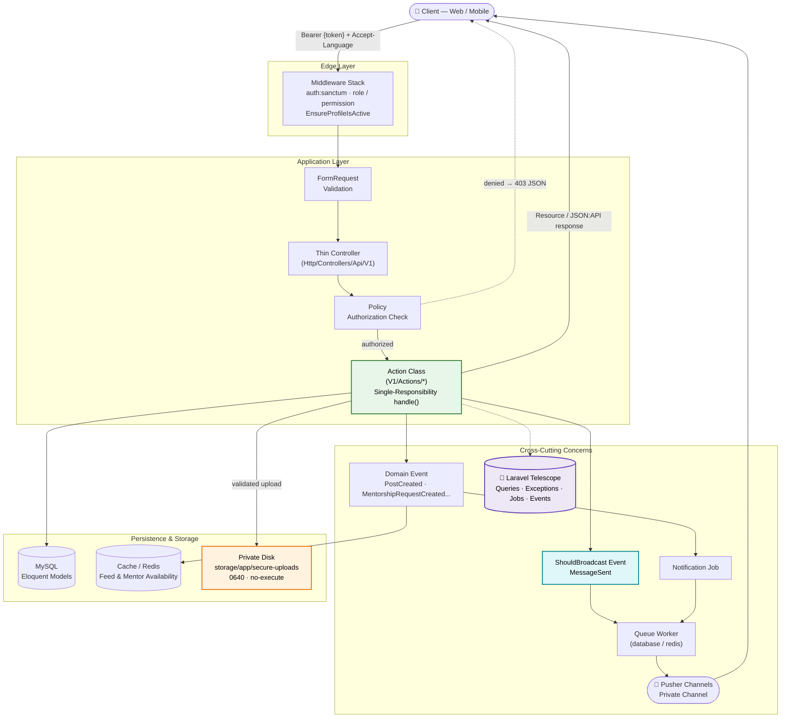

# 🎓 Alumni Network — API V1

<p align="center">
  
  
  
  
  
</p>

<p align="center">
  <em>A Sanctum-secured, role-based backend platform for a university alumni ecosystem — connecting alumni, students, universities, and mentorship programs through a real-time, security-hardened REST API.</em>
</p>

---

## Introduction | مقدمة

<details>
<summary><strong>English</strong></summary>

**Alumni Network** is a **Laravel 13** backend API that powers a multi-university alumni platform. It manages the full lifecycle of an academic community — from **registration and university-scoped approval workflows**, through **alumni/student profiles, job listings, mentorship programs, and connections**, to a **real-time private messaging engine** and an activity **feed** driven by domain events.

The codebase is deliberately engineered around **thin controllers**, **single-purpose Action classes**, and a **hardened file-upload pipeline**, so that every unit of business logic is small, independently testable, and easy to reason about — even as the number of domains (alumni, students, universities, jobs, events, mentorship, messaging, reports…) keeps growing.

</details>

<details>
<summary><strong>العربية</strong></summary>

**Alumni Network** هو Backend API مبني بإطار عمل **Laravel 13**، يشغّل منصة خريجين متعددة الجامعات. يدير النظام الدورة الكاملة لمجتمع أكاديمي متكامل — بدءاً من **التسجيل وتدفقات الموافقة على مستوى كل جامعة**، مروراً بـ **ملفات الخريجين والطلاب، وإعلانات الوظائف، وبرامج الإرشاد الأكاديمي (Mentorship)، وشبكة التواصل بينهم**، وصولاً إلى **محرك مراسلة فورية خاصة** وخلاصة أنشطة (Feed) مبنية على الأحداث (Events).

تم بناء الكود البرمجي عن قصد حول مبدأ **المتحكمات النحيفة (Thin Controllers)**، وفئات **أفعال (Actions) أحادية المسؤولية**، و**خط أنابيب رفع ملفات محصّن أمنياً**، بحيث تبقى كل وحدة من منطق العمل صغيرة، قابلة للاختبار بشكل مستقل، وسهلة الفهم — حتى مع استمرار نمو عدد النطاقات (خريجون، طلاب، جامعات، وظائف، فعاليات، إرشاد أكاديمي، مراسلة، تقارير...).

</details>

---

## Key Architectural Decisions | القرارات المعمارية الأساسية

The four pillars below explain **why** the system is built the way it is, not just **what** it contains.

### 1. Action Pattern — Single-Responsibility Business Logic | نمط الأفعال (Action Pattern)

<details>
<summary><strong>English</strong></summary>

Instead of routing business logic through bloated Controllers or a monolithic Service Layer shared across unrelated concerns, every use case in `app/V1/Actions/` is its own invokable class with a single public `handle()` method — e.g. `CreateMentorshipRequestAction`, `RegisterForEvent`, `ApproveRegistrationAction`. The project currently ships **80+ Action classes across 20 domains** (Alumni Profile, Connections, Jobs, Mentorship, Messages, Reports, University Admin, and more).

**Why this matters:**
- **SRP compliance (SOLID):** each Action does exactly one thing — a Controller method almost never exceeds a few lines, since it just validates the request (via a dedicated `FormRequest`), resolves the Action from the container, and returns a Resource.
- **Testability:** Actions are plain, dependency-injected classes with no HTTP context baked in — they can be unit-tested by calling `handle()` directly, with no need to boot a fake request/response cycle.
- **Reusability across modules:** the same Action can be called from an HTTP controller today and from a console command, a queued job, or another Action tomorrow, without duplicating logic.
- **Predictable code navigation:** because Actions are named after the exact use case they implement (verb + domain noun), any engineer can locate the logic for "reject a mentorship request" without reading through a 500-line `MentorshipController`.

</details>

<details>
<summary><strong>العربية</strong></summary>

بدلاً من تمرير منطق العمل عبر متحكمات (Controllers) متضخمة أو طبقة خدمات (Service Layer) ضخمة ومشتركة بين مهام غير مترابطة، كل حالة استخدام (Use Case) داخل `app/V1/Actions/` هي فئة مستقلة تُستدعى عبر ميثود عام واحد اسمه `handle()` — مثل `CreateMentorshipRequestAction` و `RegisterForEvent` و `ApproveRegistrationAction`. يحتوي المشروع حالياً على **أكثر من 80 فئة Action موزعة على 20 نطاقاً عملياً** (ملفات الخريجين، الاتصالات، الوظائف، الإرشاد الأكاديمي، الرسائل، التقارير، إدارة الجامعات، وغيرها).

**لماذا هذا القرار مهم:**
- **الالتزام بمبدأ SRP (من مبادئ SOLID):** كل Action يقوم بمهمة واحدة فقط — ميثود الكونترولر لا يتجاوز عادة بضعة أسطر، لأنه فقط يتحقق من صحة الطلب (عبر `FormRequest` مخصص)، ثم يستدعي الـ Action من الحاوية (Container)، ويعيد الاستجابة عبر Resource.
- **سهولة الاختبار (Testability):** الأكشنز عبارة عن فئات عادية تُحقن فيها التبعيات (Dependency Injection) دون أي ارتباط بسياق HTTP، مما يسمح باختبارها بشكل مباشر عبر استدعاء `handle()` دون الحاجة لمحاكاة دورة كاملة لطلب واستجابة.
- **إعادة الاستخدام عبر الموديولات:** يمكن استدعاء نفس الـ Action من متحكم HTTP اليوم، ومن أمر Console أو Job مُجدول أو Action آخر غداً، دون تكرار المنطق.
- **سهولة التنقل داخل الكود:** بما أن كل Action يحمل اسماً يعبّر عن حالة الاستخدام بدقة (فعل + اسم النطاق)، يستطيع أي مطور إيجاد منطق "رفض طلب إرشاد أكاديمي" دون قراءة كونترولر مكوّن من 500 سطر.

</details>

---

### 2. Observability via Laravel Telescope | المراقبة عبر Laravel Telescope

<details>
<summary><strong>English</strong></summary>

`laravel/telescope` is wired in as a development dependency and gated behind an explicit `viewTelescope` **Gate** (email allow-list, see `TelescopeServiceProvider`), so it can safely stay reachable in a protected/staging environment, not just `local`.

**What it's used for:**
- **N+1 query detection:** since `Model::preventLazyLoading()` is enabled globally (`AppServiceProvider::boot()`), any accidental N+1 access throws immediately in non-production, and Telescope's **Queries** panel gives a full, timed breakdown of every SQL statement per request to catch it before it does.
- **Exception visibility:** every reportable exception is captured with full context, which matters most on an API where clients only ever see a generic localized JSON error envelope (see the centralized `withExceptions()` handler in `bootstrap/app.php`).
- **Scheduled tasks & failed jobs:** the notification pipeline (job dispatch for mentorship/connection/event notifications) is entirely queue-driven — Telescope's **Jobs** and **Schedule** panels are what make silent queue failures visible instead of invisible.
- **Realtime broadcast events:** Telescope's **Events** panel surfaces every `event()` dispatch, including `MessageSent`, `PostCreated`, `MentorshipRequestCreated`, and `MentorshipRequestStatusUpdated` — useful for confirming a broadcast actually fired without needing a connected WebSocket client.
- **Noise control in non-local environments:** the `Telescope::filter()` closure only records *everything* when `APP_ENV=local`; elsewhere it narrows down to reportable exceptions, failed requests, failed jobs, scheduled tasks, and explicitly tagged entries — keeping the `telescope_entries` table lean in a shared environment.

</details>

<details>
<summary><strong>العربية</strong></summary>

تم دمج `laravel/telescope` كاعتمادية تطوير (Dev Dependency)، ومحمي عبر **Gate** صريح باسم `viewTelescope` (قائمة بريد إلكتروني مسموح بها، انظر `TelescopeServiceProvider`)، بحيث يمكن إبقاءه متاحاً بأمان في بيئة محمية أو staging وليس فقط في `local`.

**استخدامات Telescope في المشروع:**
- **اكتشاف مشكلة N+1:** بما أن `Model::preventLazyLoading()` مفعّل بشكل عام (`AppServiceProvider::boot()`)، فإن أي وصول عرضي بنمط N+1 يرمي استثناءً فورياً خارج بيئة الإنتاج، وتقدم لوحة **Queries** في Telescope تفصيلاً زمنياً كاملاً لكل استعلام SQL في كل طلب لالتقاط المشكلة قبل وقوعها فعلياً في الإنتاج.
- **رصد الاستثناءات:** يتم التقاط كل استثناء قابل للتقرير مع سياقه الكامل، وهذا مهم بشكل خاص في API حيث لا يرى العميل سوى رسالة خطأ JSON عامة ومترجمة (انظر معالج `withExceptions()` المركزي في `bootstrap/app.php`).
- **المهام المجدولة والمهام الفاشلة:** خط أنابيب الإشعارات (إرسال Jobs لإشعارات الإرشاد الأكاديمي والاتصالات والفعاليات) مبني بالكامل على نظام الطوابير (Queues) — لوحتا **Jobs** و **Schedule** في Telescope هما ما يكشفان فشل الطابير الصامت بدلاً من أن يمر دون ملاحظة.
- **أحداث البث الفوري (Realtime):** تُظهر لوحة **Events** في Telescope كل عملية `event()` تم إطلاقها، بما فيها `MessageSent` و `PostCreated` و `MentorshipRequestCreated` و `MentorshipRequestStatusUpdated` — مفيدة للتأكد من إطلاق حدث البث فعلياً دون الحاجة لعميل WebSocket متصل.
- **التحكم بالضجيج خارج البيئة المحلية:** دالة `Telescope::filter()` تسجّل *كل شيء* فقط عندما تكون `APP_ENV=local`؛ أما في البيئات الأخرى فيقتصر التسجيل على الاستثناءات القابلة للتقرير، والطلبات الفاشلة، والمهام الفاشلة، والمهام المجدولة، والإدخالات الموسومة صراحةً — للحفاظ على جدول `telescope_entries` خفيفاً في بيئة مشتركة.

</details>

---

### 3. Realtime Messaging Engine | محرك المراسلة الفورية

<details>
<summary><strong>English</strong></summary>

The realtime layer is built on Laravel's native **Event Broadcasting** contract (`ShouldBroadcast`) with **Pusher Channels** (`pusher/pusher-php-server`) as the broadcaster, and **Redis** (`predis/predis`) available as the queue/cache backend for horizontal scaling.

**How it works:**
- **`MessageSent`** is the canonical realtime event: it implements `ShouldBroadcast` and is pushed on a **private channel** scoped to the conversation (`PrivateChannel('conversation.{conversationId}')`). Channel authorization lives in `routes/channels.php` and strictly checks that the requesting user is one of the conversation's two participants — no user can ever subscribe to a conversation they aren't part of.
- **Trimmed payloads:** `broadcastWith()` sends only the fields the frontend actually needs (id, content, sender, timestamp) instead of serializing the full `Message` model with its relations, keeping the socket payload small.
- **Not every domain event broadcasts to the browser.** Events like `PostCreated`, `MentorshipRequestCreated`, and `MentorshipRequestStatusUpdated` are plain server-side Laravel events (no `ShouldBroadcast`) — they drive internal **Listeners** such as `InvalidateFeedCacheForConnections` and `ClearAvailableMentorsCache`, keeping cached feed/availability data consistent without pushing anything to a client socket.
- **Queues decouple delivery from the request cycle:** because `MessageSent implements ShouldBroadcast` (not `ShouldBroadcastNow`), Laravel automatically pushes the broadcast job onto the queue — the HTTP response for "send message" returns immediately, and the actual Pusher push happens asynchronously via a queue worker (`php artisan queue:listen`), so a slow or momentarily unavailable broadcaster never blocks the API.
- **Async notification jobs follow the same philosophy:** connection-accepted, mentorship-status, and event-reminder notifications are all dispatched through dedicated `Job` classes (`app/Jobs/`) rather than sent inline, for the same reason — notification delivery should never hold up the request/response cycle.

</details>

<details>
<summary><strong>العربية</strong></summary>

طبقة الأحداث الفورية مبنية على عقد **Event Broadcasting** الأصلي في Laravel (`ShouldBroadcast`) باستخدام **Pusher Channels** (`pusher/pusher-php-server`) كمزود بث، مع توفر **Redis** (`predis/predis`) كواجهة خلفية للطوابير والكاش لدعم التوسع الأفقي.

**آلية العمل:**
- **`MessageSent`** هو الحدث الفوري الأساسي: ينفذ واجهة `ShouldBroadcast` ويُبث على **قناة خاصة (Private Channel)** مرتبطة بالمحادثة تحديداً (`PrivateChannel('conversation.{conversationId}')`). صلاحية الاشتراك بالقناة معرّفة في `routes/channels.php` وتتحقق بدقة من أن المستخدم الطالب هو أحد طرفي المحادثة فعلياً — لا يمكن لأي مستخدم الاشتراك بمحادثة لا ينتمي إليها.
- **حمولة بيانات مختصرة:** دالة `broadcastWith()` ترسل فقط الحقول التي تحتاجها الواجهة الأمامية فعلياً (المعرف، المحتوى، المرسل، الطابع الزمني) بدلاً من تسلسل نموذج `Message` بالكامل مع علاقاته، مما يبقي حجم حمولة الـ Socket صغيراً.
- **ليست كل الأحداث الداخلية تُبث للمتصفح.** أحداث مثل `PostCreated` و `MentorshipRequestCreated` و `MentorshipRequestStatusUpdated` هي أحداث Laravel داخلية عادية (لا تنفذ `ShouldBroadcast`) — تُستخدم لتشغيل **Listeners** داخلية مثل `InvalidateFeedCacheForConnections` و `ClearAvailableMentorsCache`، للحفاظ على اتساق بيانات الخلاصة (Feed) والتوفر المخزنة مؤقتاً دون بث أي شيء لعميل متصل.
- **الطوابير تفصل التسليم عن دورة الطلب:** بما أن `MessageSent` ينفذ `ShouldBroadcast` (وليس `ShouldBroadcastNow`)، فإن Laravel يضع مهمة البث تلقائياً في الطابور — استجابة HTTP الخاصة بـ"إرسال رسالة" تعود فوراً، بينما يحدث البث الفعلي عبر Pusher بشكل غير متزامن من خلال عامل طابور (`php artisan queue:listen`)، بحيث لا يؤدي أي بطء أو تعطل مؤقت في مزود البث إلى تعطيل الـ API.
- **مهام الإشعارات غير المتزامنة تتبع نفس الفلسفة:** إشعارات قبول الاتصال، وحالة الإرشاد الأكاديمي، وتذكير الفعاليات تُرسل جميعها عبر فئات `Job` مخصصة (`app/Jobs/`) بدلاً من إرسالها بشكل مباشر ومتزامن، لنفس السبب — تسليم الإشعارات لا يجب أن يوقف دورة الطلب/الاستجابة أبداً.

</details>

---

### 4. Attachment & File Security Architecture | معمارية أمن المرفقات

<details>
<summary><strong>English</strong></summary>

Every uploaded file goes through a dedicated three-layer pipeline in `app/Services/` behind two contracts in `app/Contracts/AttachmentSecurity/` (`FileValidatorInterface`, `SecureFileStorageInterface`), bound via the container in `AppServiceProvider` for full dependency inversion and testability.

**a) Private storage over public disk.** Validated attachments are moved out of `getRealPath()`'s temp location into `storage/app/secure-uploads/user_{id}/{Y}/{m}/{d}/`, a per-user, date-partitioned tree that lives **outside the public webroot** by default — nothing here is directly reachable by a guessable URL the way `storage/app/public` would be. Stored files are `chmod`'d to `0640` (owner/group read-write, **zero execute permission for anyone**), so even a file that somehow slipped past validation can never be executed as a script.

**b) Ownership-scoped, filename-format-locked retrieval.** `SecureFileStorageService::getSecurePath()` refuses to resolve *anything* that doesn't match the exact generated-filename regex (`timestamp_hex.ext`) and only ever searches inside the requesting user's own directory tree — a mismatch returns `null` rather than a distinguishing error, closing off IDOR-style enumeration. This ownership-aware resolution is exactly the pattern needed to safely front the storage with **Laravel's native temporary signed URLs**: because the real path is never derivable from the outside, a short-lived signed download link (`URL::temporarySignedRoute()`) can be issued per request without ever exposing a permanent or predictable public path to the underlying file.

**c) Content-verified MIME/extension validation.** `FileValidatorService` never trusts the client-supplied MIME type or the file's extension. Its validation order is: upload-transfer integrity → size bounds (5MB cap) → **content-based MIME detection** (`finfo`/`getimagesize`/`mime_content_type`, in that order of reliability) → strict allowlist check → **extension-vs-detected-MIME consistency** (blocks the classic `shell.php.jpg` double-extension trick) → **magic-byte header verification** for images (JPEG `FFD8FF`, PNG signature, GIF87a/89a, WEBP RIFF/WEBP markers) and a `%PDF-` signature check for PDFs → null-byte and embedded `<?php` / `<script>` / `javascript:` pattern rejection for plaintext uploads. Only after every check passes is a cryptographically random filename generated (`random_bytes(16)` hex + timestamp), completely discarding the client-supplied original name — this is the layer that closes off RCE-via-upload and polyglot-file attacks before a single byte reaches permanent storage.

</details>

<details>
<summary><strong>العربية</strong></summary>

كل ملف يتم رفعه يمر عبر خط أنابيب من ثلاث طبقات داخل `app/Services/`، خلف عقدين في `app/Contracts/AttachmentSecurity/` (`FileValidatorInterface` و `SecureFileStorageInterface`)، مربوطين عبر الحاوية (Container) داخل `AppServiceProvider` لتحقيق مبدأ Dependency Inversion وسهولة الاختبار الكاملة.

**أ) تخزين خاص بدلاً من قرص عام (Private Disks vs Public Storage).** المرفقات التي اجتازت التحقق يتم نقلها من الموقع المؤقت (`getRealPath()`) إلى `storage/app/secure-uploads/user_{id}/{Y}/{m}/{d}/`، وهي شجرة مجلدات مقسّمة حسب المستخدم والتاريخ وتقع **خارج جذر الموقع العام (Public Webroot)** افتراضياً — لا شيء هنا يمكن الوصول إليه مباشرة عبر رابط قابل للتخمين كما هو الحال في `storage/app/public`. يتم ضبط صلاحيات الملفات المخزنة على `0640` (قراءة وكتابة للمالك والمجموعة فقط، **صفر صلاحية تنفيذ لأي أحد**)، بحيث لا يمكن تنفيذ أي ملف تسلّل عبر التحقق كسكربت مطلقاً.

**ب) استرجاع مقيّد بالملكية وصيغة اسم الملف.** دالة `SecureFileStorageService::getSecurePath()` ترفض حل أي مسار لا يطابق تماماً صيغة اسم الملف المولّد تلقائياً (`timestamp_hex.ext`)، ولا تبحث إلا داخل شجرة مجلدات المستخدم الطالب نفسه — أي عدم تطابق يُعيد `null` بدلاً من رسالة خطأ مميزة، مما يغلق الباب أمام هجمات تعداد نمط IDOR. آلية الاسترجاع الواعية بالملكية هذه هي بالضبط النمط اللازم لدمج **نظام Laravel الأصلي للروابط الموقّعة المؤقتة (Temporary Signed URLs)** بأمان: بما أن المسار الحقيقي غير قابل للاشتقاق من الخارج، يمكن إصدار رابط تحميل موقّع محدود الصلاحية (`URL::temporarySignedRoute()`) لكل طلب دون كشف مسار دائم أو قابل للتخمين للملف الفعلي على القرص.

**ج) تحقق من نوع الملف الفعلي (MIME/Extension) قائم على المحتوى.** لا تثق `FileValidatorService` أبداً بنوع MIME أو امتداد الملف القادمين من العميل. ترتيب التحقق هو: سلامة نقل الرفع ← حدود الحجم (سقف 5 ميغابايت) ← **الكشف عن نوع MIME الحقيقي بناءً على المحتوى** (`finfo`/`getimagesize`/`mime_content_type`، بهذا الترتيب من حيث الموثوقية) ← التحقق من قائمة مسموحة صارمة ← **التحقق من تطابق الامتداد مع نوع MIME المكتشف** (يمنع حيلة الامتداد المزدوج الشهيرة `shell.php.jpg`) ← **التحقق من التوقيع الثنائي (Magic Bytes)** للصور (JPEG `FFD8FF`، توقيع PNG، GIF87a/89a، علامات WEBP RIFF/WEBP) والتحقق من توقيع `%PDF-` لملفات PDF ← رفض البايتات الفارغة (Null Bytes) وأنماط `<?php` / `<script>` / `javascript:` المضمّنة في الملفات النصية. فقط بعد اجتياز كل هذه الفحوصات يتم توليد اسم ملف عشوائي مشفّر (`random_bytes(16)` بصيغة hex مع طابع زمني)، مع تجاهل الاسم الأصلي القادم من العميل بالكامل — هذه هي الطبقة التي تغلق الباب أمام هجمات RCE عبر الرفع وملفات الـ Polyglot قبل وصول أي بايت واحد إلى التخزين الدائم.

</details>

---

## System Architecture Diagram | المخطط الهندسي للنظام



---

## Directory Structure | هيكلية المجلدات

```text
alumni-network/
├── app/
│   ├── V1/
│   │   └── Actions/                # Single-responsibility use-case classes (80+)
│   │       ├── AlumniProfile/
│   │       ├── Authentication/
│   │       ├── Connection/
│   │       ├── Events/              # Event registration & attendance actions
│   │       ├── Job/
│   │       ├── Messages/
│   │       ├── MentorshipProgram/
│   │       ├── MentorshipRequest/
│   │       ├── Post/
│   │       ├── Reports/
│   │       └── UniversityAdmin/
│   ├── Http/
│   │   ├── Controllers/Api/V1/     # Thin controllers — delegate to Actions
│   │   ├── Requests/                # FormRequest validation, one folder per domain
│   │   ├── Resources/Api/           # API Resource transformers (JSON shaping)
│   │   └── Middleware/              # EnsureProfileIsActive, etc.
│   ├── Events/                      # PostCreated, MessageSent (ShouldBroadcast)...
│   ├── Listeners/                   # ClearAvailableMentorsCache, InvalidateFeedCache...
│   ├── Jobs/                        # Queued notification dispatch
│   ├── Notifications/
│   ├── Mail/
│   ├── Policies/                    # 14 authorization policies
│   ├── Services/                    # FileValidatorService, SecureFileStorageService,
│   │                                 #   UploadFileService, LaravelUniversityContext
│   ├── Contracts/
│   │   └── AttachmentSecurity/      # FileValidatorInterface, SecureFileStorageInterface
│   ├── Builders/                    # Custom Eloquent query builders
│   ├── Enums/                       # MentorshipRequestStatus, PostVisibility, ...
│   ├── Models/
│   └── Providers/                   # AppServiceProvider, TelescopeServiceProvider
├── routes/
│   ├── api.php                      # Loads routes/Api/V1/*.php under prefix "v1"
│   ├── Api/V1/                      # One route file per domain (route splitting)
│   ├── channels.php                 # Private channel authorization (Broadcast::channel)
│   └── web.php
├── storage/
│   └── app/secure-uploads/          # Private, non-public attachment storage
├── tests/
│   ├── Feature/                     # Route-level test suites per domain
│   └── Unit/
└── database/
    ├── migrations/
    ├── factories/
    └── seeders/
```

---

## API Reference | مرجع الـ API

### Global Request Headers | الترويسات القياسية

| Header | Value | Description | الوصف |
| :--- | :--- | :--- | :--- |
| `Accept` | `application/json` | Ensures the API returns JSON instead of an HTML error page. | لضمان استجابة JSON بدلاً من صفحة خطأ HTML. |
| `Authorization` | `Bearer {token}` | Required on every protected route — a Sanctum personal access token. | مطلوب في كل مسار محمي — توكن وصول شخصي عبر Sanctum. |
| `Content-Type` | `application/json` or `multipart/form-data` | JSON for standard payloads; multipart when uploading a file (e.g. profile photo, post image). | JSON للحمولات العادية، ومتعدد الأجزاء عند رفع ملف. |

### Standard Error Envelope | صيغة الأخطاء الموحدة

Centralized in `bootstrap/app.php` via `withExceptions()` — every API exception is normalized before it reaches the client:

| Status | Case | الحالة |
| :--- | :--- | :--- |
| `403` | `AuthorizationException` / Spatie `UnauthorizedException` → `"This action is unauthorized."` | إجراء غير مصرح به |
| `404` | `NotFoundHttpException` → `"The requested resource was not found."` | المورد غير موجود |
| `422` | `FormRequest` validation failure, field-level messages | فشل التحقق من صحة البيانات |

### Authentication Flow | تدفق المصادقة

`POST /api/v1/auth/register` → account created with **pending** status → a university admin (`role:uni_admin`) reviews it via `POST /api/v1/uni_admin/universities/{university}/registrations/{user}/approve` → the user can then `POST /api/v1/auth/login` to receive a Sanctum bearer token.

---

## Installation & Setup | التثبيت والإعداد

### Prerequisites | المتطلبات

- **PHP >= 8.5** with the `fileinfo` extension enabled (required by the file-security pipeline)
- **Composer 2.x**
- **Redis** (recommended for `QUEUE_CONNECTION` / `CACHE_STORE` in production)
- A **Pusher** account (or a Pusher-protocol-compatible service) for realtime broadcasting

### Steps | الخطوات

```bash
# 1. Clone the repository
git clone https://github.com/khederAlkhateeb/Alumni-Network
cd alumni-network

# 2. Install PHP dependencies
composer install

# 3. Environment setup
cp .env.example .env
php artisan key:generate
# → then configure DB_*, REDIS_*, PUSHER_*, and BROADCAST_CONNECTION in .env

# 4. Run database migrations
php artisan migrate

# 5. (Optional) Seed roles, permissions, and demo data
php artisan db:seed

# 6. Publish & migrate Telescope's own tables (dev/staging only)
php artisan telescope:install
php artisan migrate

```

> `composer run dev` runs `php artisan serve`, `php artisan queue:listen`and `php artisan pail` (live logs)
concurrently — everything needed for local development, including the queue worker that actually delivers realtime broadcasts and notification jobs, in a single command.

### Running the WebSocket-facing broadcaster | تشغيل خادم البث

```bash
# Set BROADCAST_CONNECTION=pusher and fill in PUSHER_APP_* in .env, then
# the queue worker above (php artisan queue:listen) is what pushes
# queued ShouldBroadcast events out to Pusher — no separate process
# is required beyond a running queue worker and valid Pusher credentials.
```

---

## Tech Stack | حزمة التقنيات

| Layer | Technology |
| :--- | :--- |
| Framework | Laravel `^13.8` on PHP `^8.5` |
| Authentication | Laravel Sanctum `^4.0` (Bearer tokens) |
| Authorization | Spatie Laravel Permission `^8.3` (role & permission middleware) + Policies |
| Realtime Broadcasting | Pusher Channels (`pusher/pusher-php-server ^7.2.8`) over queued `ShouldBroadcast` events |
| Queue / Cache Backend | Redis (`predis/predis ^3.5`) — configurable per environment |
| Observability | Laravel Telescope `^5.21` (gated, environment-aware filtering) |
| Testing | Pest `^12.5` — 17 Feature/Unit suites covering routes per domain |

---

## 📚 API Documentation

* **Live API Docs:** [Alumni Network API Documentation](https://nity0i8ngr.apidog.io)
